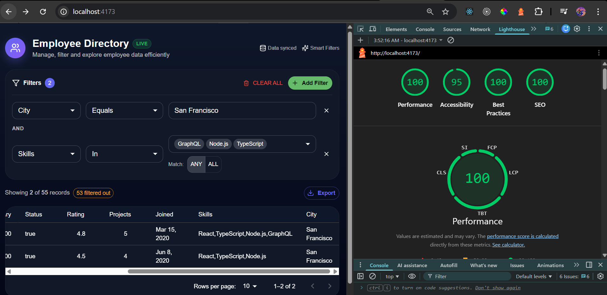

# 🚀 Employee-Hub : Dynamic Filter System – React + TypeScript

A **configuration-driven, reusable, and type-safe filtering system** built with **React 18, TypeScript, and Material UI**, designed to work seamlessly with any data table regardless of schema.

---

## 📌 Overview

This project implements a **dynamic filter builder** that allows users to:

- Add multiple filter conditions
- Dynamically select fields and operators
- Use context-aware inputs based on field type
- Apply filters in real-time
- Export filtered or selected data

The system is **fully reusable and schema-agnostic**, meaning it can be plugged into any dataset (Users, Transactions, etc.) without changing internal logic.

---

## 🎯 Key Features

### ✅ Dynamic Filter Builder

- Add/remove multiple conditions
- Field-based operator selection
- Context-aware input rendering

### ✅ Multi-Type Filtering Support

| Type         | Operators                                | Input        |
| ------------ | ---------------------------------------- | ------------ |
| Text         | Contains, Equals, Starts With, Ends With | Text input   |
| Number       | >, <, >=, <=, =                          | Number input |
| Date         | Between                                  | Date range   |
| Currency     | Between                                  | Min/Max      |
| Select       | Is / Is Not                              | Dropdown     |
| Multi-Select | In / Not In                              | Multi-select |
| Boolean      | Is                                       | Toggle       |

---

## 🧱 Architecture

The system follows a **clean separation of concerns**:

```text
UI Layer (Components)
↓
Hooks (State + Logic)
↓
Filter Engine (Business Logic)
↓
Utils (Reusable Helpers)
```

---

### 📦 Folder Structure

```text
src/
  components/
    FilterSystem/
    DataTable/
    shared/

  hooks/
    useFilterState.ts
    useTableState.ts

  engine/
    filterEngine.ts

  utils/
    formatUtils.ts

  pages/
    EmployeesPage.tsx
```

---

## 🧠 Core Design Principles

### 1. 🔥 Configuration-Driven System

All filters are defined externally:

```ts
const employeeConfig = {
  fields: [
    { key: "name", type: "text" },
    { key: "salary", type: "number" },
  ],
};
```

👉 No hardcoded logic inside components
👉 Easily reusable across different tables

---

### 2. 🧩 Reusable Component System

- `FilterPanel` → container
- `FilterRow` → individual condition
- Input components → dynamic rendering

```tsx
renderInput(condition, field);
```

👉 Enables plug-and-play architecture

---

### 3. ⚙️ Headless Logic (Hooks)

#### `useFilteredData`

- Applies filters
- Debounced execution
- Memoized for performance

#### `useTableState`

- Sorting
- Pagination
- Row selection

👉 Keeps UI components clean and stateless

---

### 4. 🧠 Filtering Engine

- Pure functions
- Handles:
  - text matching
  - numeric comparisons
  - date ranges
  - array filtering
  - nested object access

Example:

```ts
nestedGet(obj, "address.city");
```

---

### 5. 🎯 Separation of Concerns

| Layer      | Responsibility   |
| ---------- | ---------------- |
| Components | UI rendering     |
| Hooks      | State management |
| Engine     | Filtering logic  |
| Utils      | Generic helpers  |

---

## ⚡ Performance Optimizations

### ✅ Memoization

- `useMemo` for filtering, sorting, pagination
- Prevents unnecessary recalculations

### ✅ Debouncing

```ts
useDebounce(conditions, 250);
```

### ✅ Architecture

Followed Headless/Dumb Presentational Architecture

- Reduces filter execution frequency

### ✅ Row-level Rendering Optimization

- Extracted `DataRow` component
- `React.memo` used to avoid full table re-render

### ✅ Cached Nested Access

```ts
pathCache for nestedGet
```

- Avoids repeated `.split('.')`

---

## 📊 Data Handling

- Supports **50+ records**
- Handles:
  - nested objects
  - arrays
  - mixed data types

Example:

```json
{
  "address": { "city": "NY" },
  "skills": ["React", "Node"]
}
```

---

## 📋 Table Features

- Sortable columns
- Pagination
- Row selection
- Export functionality
- Record count display
- Responsive layout

---

## 📤 Export Feature

- Export to **CSV / JSON**
- Supports:
  - full dataset
  - selected rows only

---

## 🧪 Testing

Using:

- Vitest
- React Testing Library

### Covered:

- Data loading
- Skeleton loading for improving user experience and improving firts contentfull pain
- Error handling
- Rendering
- Export button presence

---

## 🛠️ Tech Stack

- React 18
- TypeScript
- Vite
- Material UI
- Lucide Icons
- Vitest + RTL

---

## 🎨 UI/UX

- Responsive layout
- Dark theme support
- Accessible (ARIA roles)
- Clean SaaS-style design

---

## 🚀 Scalability Considerations

### Current

- Pagination for 50+ records
- Filter persistence (localStorage)

### Future Enhancements

- Virtualization (react-window)
- Server-side filtering

---

## 🧠 Design Decisions

### Why Config-Driven?

- Eliminates hardcoding
- Improves reusability
- Supports multiple schemas

### Why Hooks for Logic?

- Keeps components clean
- Promotes reuse
- Easier testing

### Why Separate Filter Engine?

- Pure logic layer
- Independent testing
- Scalable for complex rules

---

## 🏁 Conclusion

This project demonstrates:

- Strong component architecture
- Advanced React patterns
- Performance optimization
- Scalable design
- Clean and maintainable code

---

## 📎 How to Run

```bash
yarn build
yarn preview
```

---

## 🧪 Run Tests

```bash
npx vitest
```

---

## 🌟 Future Improvements

- Virtualized table for large datasets
- Column resizing
- Drag-and-drop filters
- Advanced query builder

---

## 🚀 Performance Metrics

<p align="center">
  
</p>

> **“Built with performance-first architecture, achieving near-perfect Lighthouse scores across all categories.”**

## 👨‍💻 Author

Muhammed Bilal
mdbilaal777@gmail.com
Built with focus on **scalability, performance, and reusability**.
